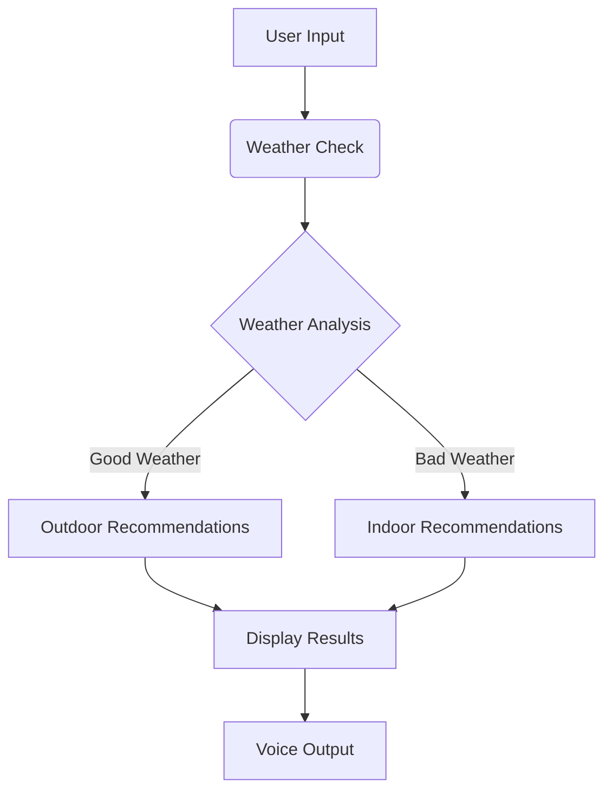

# Weather-Based Dining Advisor 🌦️🍽️

A smart, weather-aware dining recommendation system that personalizes food and dining experiences based on real-time weather data and time of day.

---

## 🌍 Project Overview

**Weather-Based Dining Advisor** intelligently combines weather insights and temporal context to provide:

- Accurate weather-based dining recommendations
- Tailored suggestions for indoor/outdoor experiences
- Iconic local dish recommendations per city
- Location-specific restaurant links
- Optional voice output for accessibility

---

## ✨ Key Features

- **☁️ Weather Integration**: Real-time data via OpenWeatherMap API
- **⏱ Time-Based Logic**: Smart logic for breakfast, lunch, and dinner
- **🍽 Local Specialties**: Curated food experiences from major cities worldwide
- **🎤 Voice Output**: Accessible suggestions using TTS with `pyttsx3`
- **📍 Google Maps Integration**: Easy-to-access links for dining spots

---

## 🧰 Architecture Diagram



---

## 🛠️ Technologies Used

- **Julep AI**: LLM workflow orchestration
- **OpenWeatherMap API**: Weather data provider
- **Python**: Core application logic
- **`pyttsx3`**: Offline text-to-speech library
- **Google Maps**: Restaurant location services

---

## 🚀 Installation Guide

### 1. Clone the Repository
```bash
git clone https://github.com/yourusername/weather-dining-advisor.git
cd weather-dining-advisor
```

### 2. Install Dependencies
```bash
pip install -r requirements.txt
```

### 3. Configure Environment Variables
```bash
cp .env.example .env
# Add your API keys inside the .env file
```

---

## 📅 Usage Instructions

### Run the Application
```bash
python dining_advisor.py
```

### Follow the Prompts
- Enter a **city name**
- Weather is fetched automatically
- Receive **personalized** dining suggestions

---

## 📅 Example Output

```
📍 Tokyo — Lunch (Indoor Dining)
🕒 Local Time: 2025-06-08 16:06
☁️ Weather: Not ideal

🍲 Iconic dishes to try:
- Sushi → [Find on Google Maps](https://www.google.com/maps/search/Sushi+in+Tokyo)
- Ramen → [Find on Google Maps](https://www.google.com/maps/search/Ramen+in+Tokyo)
- Tempura → [Find on Google Maps](https://www.google.com/maps/search/Tempura+in+Tokyo)
```

---

## 🌐 Future Enhancements

- Integration with restaurant APIs (Yelp, TripAdvisor)
- Dietary preference filters (vegan, gluten-free, etc.)
- Machine learning-based preference learning
- Historical weather trend analysis
- Mobile app version (Flutter/React Native)

---

## 📄 License

This project is licensed under the MIT License. See the [LICENSE](LICENSE) file for details.

---

## 📚 Author

Developed by Sneha Agarwal as part of the **Julep Founder's Office** application process.
